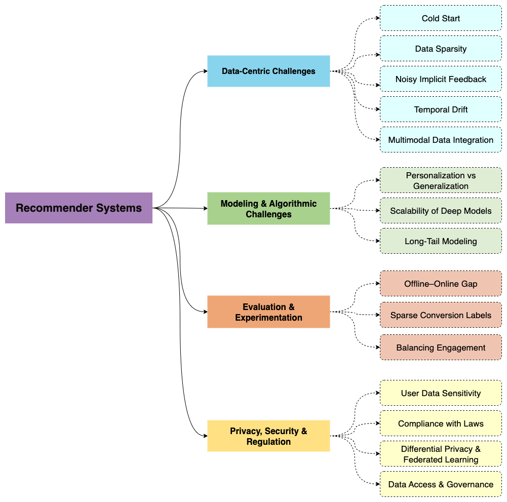

# Awesome-LLM-Driven-Recommendation

# A Comprehensive Review on Harnessing Large Language Models to Overcome Recommender System Challenges

  
 

    

This repository is a curated collection of the most influential **papers**, **frameworks**, **benchmarks**, and **resources** related to leveraging **Large Language Models (LLMs)** to address key challenges in **Recommender Systems**.

It systematically organizes advances across:

- **Data-Centric Challenges** — cold start, sparsity, multimodal data, and temporal dynamics  
- **Modeling & Algorithmic Challenges** — personalization vs. generalization, scalability, and long-tail modeling  
- **Evaluation & Experimentation** — offline vs. online gaps, bias in feedback loops, and reliable benchmarking  
- **Privacy, Security & Regulation** — data sensitivity, fairness, and compliance with evolving legal standards  

By bridging the gap between traditional RecSys approaches and modern LLM-driven techniques, this repository serves as a **comprehensive resource for both researchers and practitioners** aiming to build the next generation of recommendation technologies.

Our work is based on the following paper:  
📄 **A Comprehensive Review on Harnessing Large Language Models to Overcome Recommender System Challenges**  
Available on [arXiv](https://arxiv.org/abs/2507.21117), [ResearchGate](#), [Preprints](#), [PDF](#)  

#### Authors  

- [Rahul Raja](https://www.linkedin.com/in/rahulraja963/) — LinkedIn, Carnegie Mellon University ([50 citations](https://scholar.google.com/citations?hl=en&user=fLloCIEAAAAJ))  
- [Arpita Vats](https://www.linkedin.com/in/arpita-v-0a14a422/) — LinkedIn, Boston University, Santa Clara University ([190 citations](https://scholar.google.com/citations?user=6s2eRbIAAAAJ&hl=en))  
- [Anshaj Vats](https://github.com/AnshajVats) — Meta, San Francisco State University  
- [Anirbann Majumdar]() — Amazon  

Feel free to ⭐ star and fork this repository to keep up with the latest advancements and contribute to the community.

If our work has been of assistance to you, please feel free to cite our survey. Thank you.

  
<!--    -->

Taxonomy of recommender system challenges and corresponding LLM-based solutions. The framework categorizes challenges into four major areas—data-centric, modeling and algorithmic, evaluation, and privacy/security—each with sub-problems and LLM-driven strategies for addressing them.

# 📚 LLMs for Recommender Systems Surveys

| Title | Task | Publication Date | Link |
|---------------------------------|------|----------------|---------------------------------|
| A Comprehensive Review on Harnessing Large Language Models to Overcome Recommender System Challenges | RecSys + LLMs| 2025 | [Arxiv](https://arxiv.org/abs/2507.21117) |
| A Survey on Post-training of Large Language Models | LLM Post-training | 2025 | [Arxiv](https://arxiv.org/abs/2503.06072) |
| LLM Post-Training: A Deep Dive into Reasoning Large Language Models | Reasoning LLMs | 2025 | [Arxiv](https://arxiv.org/pdf/2502.21321) |
| From System 1 to System 2: A Survey of Reasoning Large Language Models | Reasoning LLMs | 2025 | [Arxiv](https://arxiv.org/abs/2302.11867) |
| Empowering LLMs with Logical Reasoning: A Comprehensive Survey | Reasoning LLMs | 2025 | [Arxiv](https://arxiv.org/abs/2502.15652) |
| A Survey of Large Language Models for Recommendation | RecSys + LLMs | 2024 | [Arxiv](https://arxiv.org/abs/2402.18590) |
| A Survey on Conversational Recommendation with Large Language Models | Conversational RecSys | 2023 | [Arxiv](https://arxiv.org/abs/2305.19860) |

## 🧭 Problem Areas → LLM-Driven Solutions (Quick Map)

- **Cold Start & Sparsity** → content-conditioned generation; representation bootstrapping from text/metadata; zero-/few-shot personalization; cross-domain transfer via language
- **Retrieval & Ranking** → prompted candidate generation (dual encoders); language-native scoring; LLM-guided re-ranking; RAG-based recommendation
- **Noisy Implicit Feedback** → context-aware relabeling via prompts; soft-label denoising; counterfactual reasoning templates
- **Temporal Drift** → prompt-based temporal adaptation; hybrid LLM-parameterized user updates; session-aware prompting
- **Multimodal Integration** → modal-aware attention/gating; unified instruction-tuned encoding; cross-modal alignment; generative imputation
- **Evaluation** → counterfactual evaluation; offline metric recalibration; simulation; LLM-generated evaluation rubrics
- **Privacy & Governance** → data minimization with instructable filters; token-level attribution; DP/federated prompting and training

(See the survey for formulas, architectures, and trade-offs.) :contentReference[oaicite:1]{index=1}

## Affiliations

